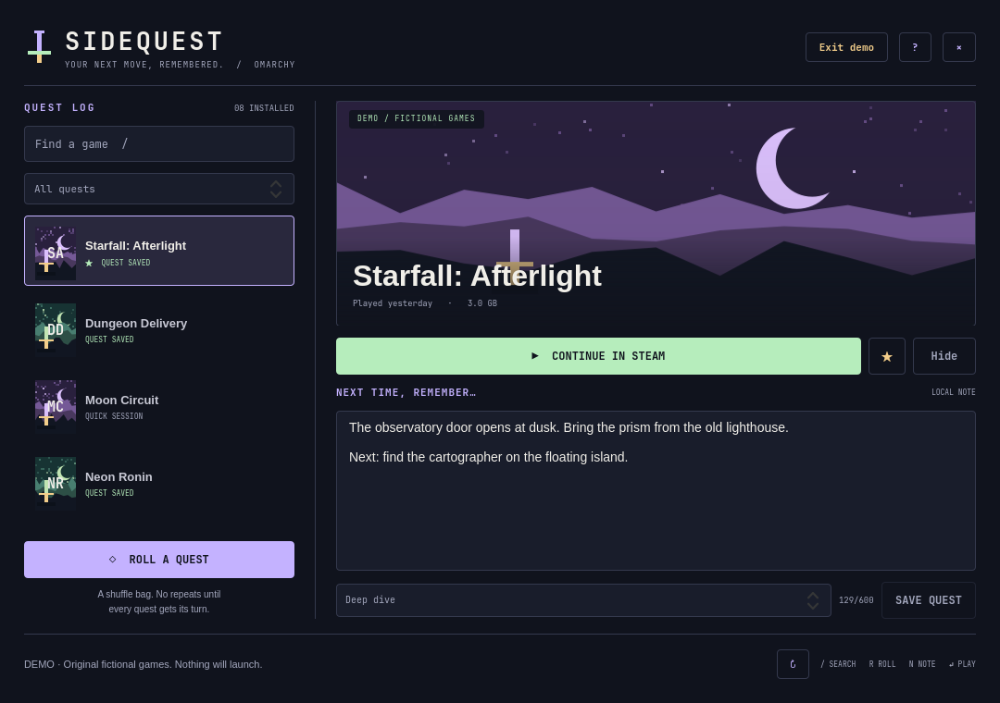

# Sidequest

**Your next move, remembered.** A fast, native JRPG quest journal for Omarchy and your installed Steam games.

You return to a game after a week. Which door needed the key? What was that boss weak to? Why are you carrying forty mushrooms?

Leave future you a quest note. When you cannot pick a game, let the shuffle bag decide.



- **Continue with context.** Keep a next-session note beside each game, then launch it in Steam.
- **Roll a quest.** Draw from the current search or filter. Every eligible game gets a turn before the bag resets. Rolling never launches a game.
- **Make your own quest pools.** Favourites, games with notes, and your own Quick session / Deep dive / Party time tags.
- **A quiet local library.** Reads installed games across Steam library folders, uses already-cached cover art, and tucks away Proton and Steam runtimes. Hide any other entry and restore it from Hidden games.
- **Fast by design.** Search stays in memory. One short-lived Python helper serves every monitor. No polling, background daemon, or idle animation.
- **Built for Omarchy.** Lives in the Quattro bar, opens as a native keyboard panel, respects the session lock, and fits compact displays.

The demo uses fictional games and original procedural pixel landscapes. It works without Steam, never writes your real notes, and never launches anything.

## Install

Requires **Omarchy 4 / Quattro**, Python 3, and Steam with at least one installed game. Native Steam and the standard Flatpak Steam installation are recognized. Python, QtQuick, and Quickshell are already part of a normal Omarchy installation; there are no pip/npm packages or API keys to configure.

```sh
omarchy plugin add https://github.com/LostandAdrift/omarchy-sidequest --enable --yes
```

Click the sword in the bar. You can also summon it from a terminal or your own keybinding:

```sh
omarchy-shell shell toggle io.github.lostandadrift.sidequest '{}'
```

The plugin does not install or overwrite a keybinding. Use Omarchy's bar settings to move the sword or enable **Reduce motion**.

## Controls

| Key | Action |
| --- | --- |
| `/` | Search installed games |
| `↑` / `↓` | Select a game |
| `R` | Roll the current quest pool |
| `N` | Edit the selected game's note |
| `F` | Toggle favourite |
| `Enter` | Request launch from Steam |
| `Ctrl+S` | Save the note and session tag |
| `Escape` | Leave the editor, clear search, or close |
| `Tab` / `Shift+Tab` | Move between controls |

Letters typed in the search or note editor are never game-launch shortcuts. Notes are plain text, up to 600 characters. **Save quest** commits the note and session tag. Unsaved drafts survive switching between games and refreshing while the panel remains loaded; save before disabling/removing the plugin or ending the desktop session.

Session tags are chosen by you; Sidequest does not guess game length. “Played…” comes from Steam's local `LastPlayed` field. It may be absent or differ from your Steam account's cloud history. A launch acknowledgement means the request was sent to Steam, not that the game successfully started.

## Local data and scope

Sidequest reads `steamapps/libraryfolders.vdf`, `steamapps/appmanifest_*.acf`, the existence of game installation directories, and recognized artwork in `appcache/librarycache`. It does not read Steam credentials, account settings, browsing history, cloud saves, game logs, or process command lines. It never changes Steam's files.

Notes, favourites, tags, hidden entries, and the shuffle bag are stored in:

```text
${XDG_STATE_HOME:-~/.local/state}/omarchy-sidequest/journal.json
```

The journal directory is private (`0700`); the journal is private (`0600`) and replaced atomically under a lock. Notes for uninstalled games stay in the journal and reappear when that game is reinstalled. A damaged journal is left untouched and reported in the panel.

Library indexing and notes make **no network requests**. Steam and launched games retain their normal network behavior. This is a quest notebook and launcher, not a game-save backup or a Steam account/library synchronizer. Only installed Steam applications are indexed; non-Steam shortcuts and other launchers are outside this first release.

## Update, disable, remove

```sh
omarchy plugin update io.github.lostandadrift.sidequest --yes
omarchy plugin disable io.github.lostandadrift.sidequest
omarchy plugin remove io.github.lostandadrift.sidequest --yes
```

Removal leaves your private journal intact. To erase your notes too, delete the `omarchy-sidequest` directory from your user state folder. No system service, autostart entry, keybinding, or package needs cleanup.

## Development

```sh
bash scripts/check.sh
bash scripts/check-store.sh
bash scripts/render.sh --output /tmp/sidequest.png --game 700001
python3 scripts/benchmark.py --games 1000 --runs 20
```

Tests use Python's standard `unittest`, Node's built-in test runner, and Qt's `qmltestrunner`. `SIDEQUEST_QT_BIN` can point to the Qt tools directory. The store check uses a temporary journal and reads the local Steam index without opening games. Benchmarks use only synthetic libraries. See [architecture](docs/architecture.md) and [validation](docs/validation.md).

MIT licensed. Sidequest's source, demo names, procedural artwork, and preview are original. Steam artwork stays on the user's machine and belongs to its respective owners. Sidequest is an independent community plugin, unaffiliated with Valve or the Omarchy project.
